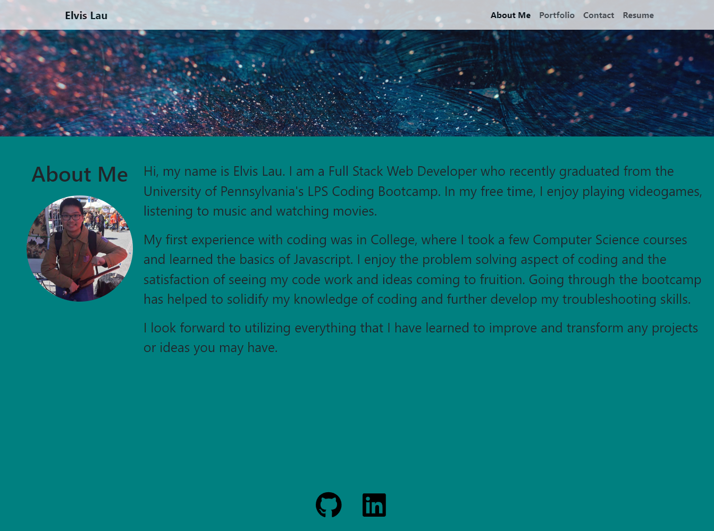

# Professional Portfolio with React

  
  ## Description

  This website is my updated professional portfolio created using React.js.

  ## Usage

  Please navigate through the site to find out more about me and my projects. 
  
  

  [Click here for the Live Site](https://elvislau.netlify.app)

  ## Credits

  N/A

  ## License

  [MIT License](https://opensource.org/licenses/MIT)

  ## Questions?

  For any questions, please click on my email provided below and visit my Github:

  - [Email me here](mailto:elvislau74@gmail.com)

  - [Click here for my Github](https://github.com/elvislau74/)
